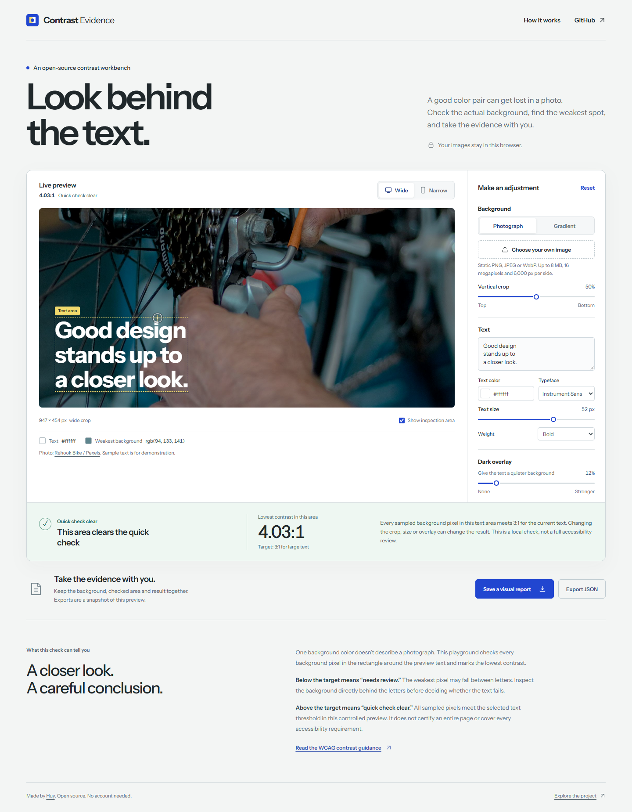

# Contrast Evidence

**Text over a photo looks readable. Can you show why?**

Capture the actual element, its background without text, and the lowest contrast in its rectangle. Keep the evidence in a portable report. Built for frontend developers and accessibility reviewers resolving contrast checks over photos and gradients.

[Try the playground](https://builtbyhuy.github.io/contrast-evidence/demo/) · [Method and limits](#what-the-result-means) · [Agent skill](skills/contrast-evidence/SKILL.md)

The playground runs entirely in your browser. Change the image crop, text color and dark overlay; locate the weakest background pixel; export an HTML report or JSON. Uploaded images stay on your device.



## Check your own page

Node.js 20 or newer. Clone this repository, install its dependencies, and explicitly install a compatible browser if one is not already available:

```sh
git clone https://github.com/builtbyhuy/contrast-evidence.git
cd contrast-evidence
npm install
npx playwright install chromium
node src/cli.js --url http://localhost:3000 --selector '.hero h1' \
  --viewport 1440x900 --viewport 390x844 --out ./evidence
```

Open `evidence/index.html`. The same captures and full numeric values are in `evidence/report.json`. To use an existing browser, add `--browser msedge` or `--browser chrome`. The tool never silently downloads or falls back to another browser.

For pages that need authentication or preparation, supply your own Playwright page:

```js
import { chromium } from 'playwright';
import { captureContrast } from '@builtbyhuy/contrast-evidence';

const browser = await chromium.launch();
const page = await browser.newPage({ viewport: { width: 390, height: 844 } });
await page.goto('http://localhost:3000');
// Perform the page's normal setup here, then capture its actual visible state.
const evidence = await captureContrast(page, { selector: '.hero h1' });
console.log(evidence.status, evidence.minimumRatio, evidence.reasons);
await browser.close();
```

This package is available from the repository, not yet published to npm. In the cloned project, import from `./src/index.js`; another project can install it with `npm install github:builtbyhuy/contrast-evidence`. API declarations are included.

## What the result means

| Status | Interpretation | CLI exit |
| --- | --- | --- |
| `quickcheck-clear` | Every sampled background pixel in the captured rectangle meets the threshold for the supported opaque CSS foreground. | `0` if every capture is clear |
| `needs-review` | The rectangle contains a lower ratio. Inspect the background behind individual letters before establishing a failure. | `1` if review is needed and none are unsupported |
| `unsupported` | Rendering effects, ambiguous text, instability or capture problems prevent a reliable conclusion. Read the reasons. | `2` if any capture is unsupported or inputs are invalid |

**A low rectangle minimum is not an automatic WCAG failure.** Bright space between letters may be the worst pixel. A clear quickcheck applies only to the supplied element, captured state and supported method; it does not certify a website.

The calculation uses the opaque computed CSS foreground, sRGB relative luminance, and unrounded ratios. Normal text uses 4.5:1; large text uses 3:1 (24 CSS px, or 14pt / 18⅔ CSS px at a bold weight). A custom threshold is supported. The report shows the threshold used.

The method follows the conservative quickcheck described in [W3C F83](https://www.w3.org/WAI/WCAG22/Techniques/failures/F83), also applied here to stationary rendered gradients. [W3C's contrast guidance](https://www.w3.org/WAI/WCAG22/Understanding/contrast-minimum.html) explains the foreground and large-text rules.

## Supported scope

Stationary, visible, opaque, single-color text with text/line-break children. The tool captures original and background-only pixels while preserving layout and restoring the element's exact inline style. It scrolls the element into view and records the viewport and bounds.

Effects such as translucent text, mixed styled descendants, colored emoji, italic text, shadows, filters, blending, unsafe pseudo-element overlays, transformations, clipping and occlusion are treated conservatively. Shadow-root targets are outside the supported scope. A tight line-height or text extending outside its element rectangle can be unsupported; capture a suitable text leaf or inspect manually. If masking text changes another rendering property, the capture is rejected. Dynamic backgrounds are outside the supported scope. Capture at a representative settled state and inspect the retained crops. This is evidence for review, not a complete accessibility audit.

## Develop and contribute

```sh
npm install
npx playwright install chromium
npm test
npm run demo
```

Open `http://127.0.0.1:4173/demo/`. `CONTRAST_BROWSER=msedge` can select an existing Edge browser for the capture tests. The playground shares `src/contrast.js` with the capture API.

Useful contributions: a reproducible capture case, a documented unsupported rendering effect, or clearer evidence presentation. Include the selector, viewport, browser version, original/background crops and expected behavior. Please use a minimal public fixture; reports can contain private page text and images.

[Why this tool and existing alternatives](docs/research.md) · [Validation](docs/validation.md) · [Asset credits](NOTICE.md)

Original code: MIT. Photo and font retain their own licenses. Built by [Huy Ho](https://github.com/builtbyhuy).
